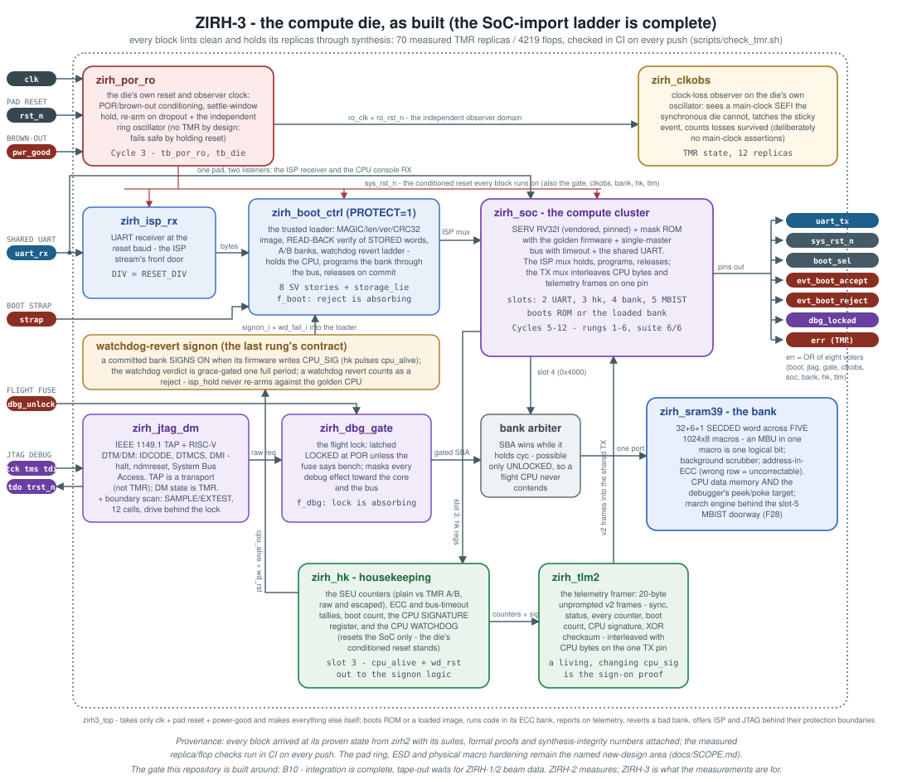

# ZIRH-3

The dedicated-die rehearsal of the ZIRH program: the radiation-
tolerant SoC whose every block was designed, verified and argued for
inside [zirh2](https://github.com/Melihakbulut221/zirh2), integrated
here into the chip those blocks were always aimed at - and GATED by
the program's own rule: silicon is committed when ZIRH-1/2 beam data
closes the open decision gates, not when the backlog feels ready.

ZIRH-2 is the experiment: a TT-harness instrument that measures the
price of placement separation. ZIRH-3 is the product rehearsal: its
own padframe, POR, controlled well-tap and guard-ring density, real
SRAM macros, a boot path from external MRAM, a lockable debug port -
on the free IHP OpenMPW ~2 mm2 open-source slot, so the rehearsal
waits behind the DATA gate, not a money gate.

## Block diagram

## What lives here now

The verified block library, imported at its proven state and kept
green by the same discipline (every suite in CI, synthesis-integrity
checked, formal proofs run on every push):

| block | role | proof |
|---|---|---|
| zirh_sram39 | 5-slice SECDED SRAM word (32+6+1 over five 1024x8 macros), background scrubber, address-in-ECC | test_sram39, f_amask, f_ecc |
| zirh_sram_bist | march/pattern engine for the macro word | test_bist |
| zirh_boot_ctrl | trusted loader: MAGIC/len/ver/CRC32 image, READ-BACK verify of the stored words, A/B banks, watchdog revert ladder, ISP | test_boot, SV scenario suite incl. the lying-memory case |
| zirh_qspi | QSPI-MRAM controller, x1/x4, backpressure = SCK freeze | test_qspi |
| zirh_dbg_gate | debug isolation: flight lock latched at POR, TMR trap to LOCKED | test_dbg_gate, f_dbg |
| zirh_clkobs | clock-loss observer on an independent RO clock | test_clkobs |
| zirh_tmr_lib | voted-feedback TMR primitives, the escape-window theorem carrier | f_ring (BMC + k-induction) |
| zirh_mbist | MBIST doorway at slot 5: march control, raw fail record, and the TMR page register that maps 256 KB through the 4 KB window | test_top_isp (ISP-loaded runner) |
| zirh_vex_wrap | the compute upgrade: VexRiscv_Lite (RV32IM, vendored) on the soc's native Wishbone; 50 MHz closed through full P&R with cache arrays on RM 2P macros, hold ECO'd and CONFIRMED - the exact layout routed, extracted and closed at every corner | pnr campaign record, tb_vex |
| zirh_bank64 | 256 KB paged bank on 4096-deep macros: 16 sliced-SECDED pages, program store (the core fetches from it) plus A/B data, CPU windowed, SBA and loader flat | test_top_isp paging + fetch proofs |
| boundary scan | SAMPLE/PRELOAD + EXTEST on the TAP, 12 cells over the functional pins, drive masked by the flight lock | tb_bscan |
| scan flow | post-synthesis scan insertion proven on a pilot block: real SG13G2 scan cells, stitched chain, shift + capture | scripts/dft_scan.sh |
| GL boot proof | the TMR-stitched gate netlist of the compute cluster (2138 flops, every one voted) boots the full ISP story inside the RTL top; a whole replica rail forced wrong is masked and heals on release; the majority-wound control falls silent | scripts/gl_boot.sh, test_top_gl |

The integration map, the honest new-design list (pad ring, ESD, POR,
the RO clock source, physical macro hardening) and the scope
discipline are in [docs/SCOPE.md](docs/SCOPE.md). The program
register mapping the commercial brief onto THIS repository is
[docs/PROGRAM.md](docs/PROGRAM.md).

## Running the proofs

    make units      # all six block suites (cocotb + iverilog)
    make sv         # the SV scenario suite (boot stories, storage_lie)
    make formal     # yosys-smtbmc + z3: ring theorem, SECDED, amask, dbg
    make tmr        # synthesis-integrity: replicas survive the optimizer
    make lint       # verilator, warning-clean policy

## Provenance

Every block arrives with its verification history in the zirh2
repository - cycle-by-cycle design notes, the bugs found and the
probes that found them. This repository starts where that one's
product program ended; nothing here is unproven code.

Apache-2.0, like everything in the program.

---

*ZIRH-2 measures. ZIRH-3 is what the measurements are for.*
